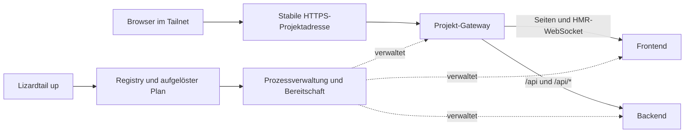

# Lizardtail: Architekturreview und Zielbild

Stand: 7. September 2026. Dieses Dokument hält das ursprüngliche Review und diskutierte Alternativen fest. Die inzwischen implementierte Architektur steht in [managed.md](managed.md), der überprüfte Host-Stand in [host-rollout-2026-09-07.md](host-rollout-2026-09-07.md). Insbesondere verwendet die Umsetzung getrennte PostgreSQL-Container pro Instanz und eine flock-geschützte JSON-Registry.

## Entscheidungsvorschlag

Lizardtail sollte ein deklarativer Projektstarter werden: Projekt beschreiben, Ressourcen verbindlich zuweisen, Prozesse überwachen, Bereitschaft prüfen und einen stabilen Browser-Endpunkt bereitstellen. Log-Erkennung bleibt höchstens eine Hilfe beim Einrichten.

Für die vorhandene Headless-Linux-Maschine empfehle ich native Prozesse unter systemd, eine Projektdatei und eine maschinenweite Ressourcenregistrierung. Nach Nutzerfeedback sind benannte Tailscale Services das bevorzugte Ziel für Projektinstanzen; feste Host-HTTPS-Ports bleiben eine mögliche Übergangslösung. Die nötige Host-Identität und Zugriffsregeln sind noch zu klären. Vorhandene Frontend-Proxys können das Backend anbinden. Caddy ist ein Kandidat für einheitliches HTTP-/WebSocket-Routing, keine Voraussetzung für benannte URLs und noch keine verbindlich gewählte Abhängigkeit.

Der grundlegende Wechsel ist das Betriebsmodell. Ein vollständiger Rewrite aller Hilfsfunktionen oder eine neue Programmiersprache ist dafür nicht erforderlich.

## Befunde im vorhandenen Code

Die folgenden Fehlerpfade sind aus dem Code abgeleitet, soweit nicht ausdrücklich als nachgestellt bezeichnet. Sie erklären mögliche Probleme, beweisen aber nicht die Ursache jedes früheren Vorfalls.

| Priorität | Befund und Auslöser | Folge | Code |
|---|---|---|---|
| Hoch | `--port` wird zum Prüfen und Veröffentlichen benutzt, aber weder als Startargument noch als Port-Umgebungsvariable an die Anwendung übergeben. | Erwarteter Port und tatsächlicher Listener können auseinanderlaufen. | `src/index.ts:812`, `:908`, `:1020` |
| Hoch | `waitForOpenPort` prüft nur TCP-Verbindbarkeit. | Ein fremder Listener erfüllt den Check; Lizardtail kann die falsche Anwendung veröffentlichen. Mit einem unabhängigen lokalen TCP-Server nachgestellt. | `src/index.ts:545` |
| Hoch | Automatische externe Portwahl liest den Tailscale-Zustand und wählt anschließend den ersten freien Port, ohne Lock oder Reservierung. Explizite Ports überspringen diese Belegungsprüfung ganz. | Gleichzeitige Aufrufe können dasselbe Ziel wählen; bestehende Routen können durch Konfigurationsupdates überschrieben werden. | `src/index.ts:597`, `:602`, `:763` |
| Hoch | Cleanup speichert nur Port und Modus, keine Zielzuordnung oder Eigentümergeneration. | Wurde die Route zwischenzeitlich ersetzt, kann der alte Prozess beim Beenden die neue Route entfernen. | `src/index.ts:808`, `:845` |
| Hoch | Ein Sammelkommando wird gestartet. Aus den letzten 8.000 Zeichen werden Kandidaten gewählt; nach 1,5 Sekunden Ruhe erfolgt die Veröffentlichung. Danach wird nicht weiter erkannt. | Ein verspäteter zweiter Server bleibt unberücksichtigt. Weitere Logausgaben können die Auswahl verschieben. Generisches Frontend/Backend hat kein eigenes Lebenszyklusmodell. | `src/index.ts:29`, `:381`, `:830`, `:971` |
| Mittel | Laravel/Vite ist ein eigener Pfad mit zwei Exposures, CORS-Proxy und Änderung von `public/hot`. | Framework-Wissen und allgemeiner Start-/Stop-Code sind eng gekoppelt. Es gibt keine gleichwertige Abstraktion für andere Mehrprozessprojekte. | `src/index.ts:620`, `:688`, `:930` |
| Mittel | Prozessgruppen werden signalisiert, aber `signalChild` kehrt zurück, sobald der direkte Kindprozess beendet ist. Auch der Eskalationstimer wird bei dessen Exit gelöscht. | Überlebende Nachfahren können der Bereinigung entgehen und Ports weiter belegen. | `src/index.ts:881`, `:1048` |
| Mittel | Tailscale-Mappings laufen mit `--bg`; Eigentum existiert nur im Speicher des Wrappers. | Nach hartem Abbruch fehlen Wiederherstellung und Abgleich. Eine alte Route kann später auf eine andere Anwendung am wiederverwendeten Port zeigen. | `src/index.ts:479`, `:841` |
| Mittel | Fehler beim Lesen des Serve-/Funnel-Zustands werden wie unbekannter/leerer Zustand behandelt. | Eine fehlgeschlagene Prüfung wird zur vermeintlich freien Portliste. | `src/index.ts:578` |
| Mittel | Nach Exposure-Fehler setzt der Wrapper Exitcode 1; am Ende gewinnt ein vorhandener Kind-Exitcode, auch 0. | Ein kooperativ mit 0 beendetes Kind kann den Fehler gegenüber einem Agent verschleiern. | `src/index.ts:923`, `:1059` |

Die Config enthält derzeit ausschließlich `blockedPorts`; sie wird im Arbeitsverzeichnis oder über `LIZARDTAIL_CONFIG` gefunden. Sie beschreibt keine Projekte, Commands, Abhängigkeiten oder Portzuweisungen (`src/index.ts:310`). Die README-Aussage „stable … first free“ verspricht zu viel: Die erste freie Nummer hängt von Startreihenfolge und Altlasten ab.

Erhaltenswert: transparente Logweitergabe, private Veröffentlichung als Standard, explizites Funnel-Opt-in, verständliche Berechtigungsfehler, blockierte Ports sowie der Schutz gegen das Überschreiben einer zwischenzeitlich geänderten Laravel-Hot-Datei.

## Drei getrennte Verantwortlichkeiten für Konfiguration

**Projektdatei im Repository:** stabile Projekt-ID, Prozessnamen, Commands als Argumentlisten, Arbeitsverzeichnisse, Abhängigkeiten, Bereitschaftschecks, HTTP-Routen und benötigte Framework-Einstellungen. Keine maschinenspezifischen absoluten Pfade oder geheimen Schlüssel.

**Host-Policy:** beispielsweise `/etc/lizardtail/config.json`, sofern wirklich mehrere Unix-Nutzer koordiniert werden müssen. Sie definiert Portbereiche, gesperrte Ressourcen und erlaubte Exposure-Arten. Bei nur einem Nutzer genügt eine gemeinsame nutzerweite Policy. Projektdateien dürfen verbindliche Host-Sperren nicht aufheben.

**Generierter Host-Zustand:** eine Registry ordnet `(Projekt-ID, Instanz-ID, Prozessname)` konkrete Ports und den externen Endpunkt zu. Sie enthält separat dauerhafte Zuordnungen und vorübergehende Laufzeit-Leases. Nicht als zweite, händisch gepflegte Projektbeschreibung verwenden.

Für mehrere Menschen und Agents unter demselben Unix-Nutzer reicht eine gemeinsame Registry mit transaktionaler Vergabe, etwa SQLite. Bei mehreren Unix-Nutzern braucht es eine einzige koordinierende Instanz mit geeigneten Zugriffsrechten; mehrere `~/.config`-Dateien verhindern keine hostweiten Konflikte.

Zuweisungen bleiben über `down` hinweg erhalten. Erst eine explizite Freigabe entfernt sie. Projektdateien können bevorzugte oder zwingende Ports verlangen; abweichende Zuweisungen werden sichtbar gemacht. Konkrete Startargumente und generierte Umgebungsvariablen kommen immer aus dem aufgelösten Plan. Ein beliebiges `PORT` wird nicht von jedem Framework verstanden.

Mehrere Worktrees brauchen eigene Instanz-IDs. Der Bookmark für `default` bleibt stabil, während beispielsweise `feature-login` eigene Ports und einen eigenen Endpunkt erhält. Zwei gleichzeitige Starts derselben Instanz müssen sich auf denselben verwalteten Lauf beziehen oder einen klaren Konflikt melden.

## Stabile URLs und Frontend/Backend

Ein Browser auf dem Laptop erreicht mit `localhost` den Laptop, nicht die Headless-Maschine. Browser-Code sollte daher normalerweise `/api` relativ zur Projekt-Origin verwenden. Serverinterne Kommunikation kann weiter über Loopback beziehungsweise interne Container-Namen laufen.

Das Gateway kann der bereits vorhandene Dev-Proxy sein. Für zusätzliche Routinganforderungen bietet sich Caddy an; dessen Reverse Proxy unterstützt WebSocket-Upgrades. API-Prefix-Erhalt oder -Entfernung muss explizit sein: `/api/users` und `/users` sind verschiedene Backend-Verträge. Auch `/api` ohne abschließenden Slash berücksichtigen. [Caddy Reverse Proxy](https://caddyserver.com/docs/caddyfile/directives/reverse_proxy)

Eine gemeinsame Origin vereinfacht CORS, Cookies und Redirects. Sie ersetzt keine korrekte Framework-Konfiguration: erlaubter Host, öffentliche Origin, vertrauenswürdiger Proxy und HMR-Adresse müssen zusammenpassen. Vite wechselt ohne `strictPort` bei belegtem Port automatisch zur nächsten Nummer. Die aktuell dokumentierte Version führt WebSocket-Optionen unter `server.ws`; ältere Projekte nutzen `server.hmr`. Setup muss die installierte Version berücksichtigen. Keine pauschale Freigabe aller Hosts oder Origins. [Vite Server Options](https://vite.dev/config/server-options)

Laravel/Vite bleibt eine explizite Framework-Integration: Asset-Origin, Hot-Datei und HMR prüfen. Eine zweite deklarierte Asset-Origin ist akzeptabel, wenn gemeinsames Routing mehr Sonderbehandlung erzeugt; dann CORS auf die konkrete App-Origin begrenzen. Ein pauschales Same-Origin-Rezept für alle Frameworks wäre erneut eine Heuristik.

## Technologische Alternativen

| Variante | Stabile Adresse | Was sie löst | Aufwand / verbleibende Aufgabe |
|---|---|---|---|
| Tailscale Serve + feste externe Ports | `https://host.tailnet.ts.net:8451` | Bookmarks ohne zusätzliche DNS-Infrastruktur | Host-Portvergabe, Prozesse und Readiness bleiben Lizardtail-Aufgabe |
| Benannte Tailscale Services | `https://projekt.tailnet.ts.net` | Projektidentität unabhängig von Hostname und Host-HTTPS-Port | Einrichtung von Service, Tags, Freigabe und Zugriffspolicy |
| Compose + Tailscale-Container pro Projekt | Eigene Tailscale-Geräteidentität | Netzisolierung; gleiche interne Ports in verschiedenen Projektnetzen | Containerisierung, Dateiwatching, Images und persistenter Tailscale-Zustand |
| Eigene Domain + Caddy über Tailscale | etwa `https://projekt.dev.example.org` | Flexible Hostnamen und Routing | Eigene DNS-/Zertifikatsverwaltung; zusätzlicher Betriebsaufwand |
| Direkter Zugriff auf die Tailscale-IP | `http://host:port` | Einfacher Transport ohne Reverse Proxy | Bind-Adressen, Portkonflikte und HTTPS bleiben ungelöst |

Tailscale Services unterstützen eigene MagicDNS-Namen und HTTPS. Voraussetzungen sind unter anderem Tailscale ≥1.86, Adminrechte für das Setup und eine getaggte Host-Identität; die Werbung muss genehmigt oder automatisch genehmigt werden. Clients ab 1.94 benötigen hierfür kein `accept-routes`. Das sind Voraussetzungen für diese Alternative, keine bereits erledigte Einrichtung. [Tailscale Services](https://tailscale.com/docs/features/tailscale-services)

Der aktuelle Host meldet Tailscale 1.102.3, Zustand `Running`, aber keine Tags an `Self`. Deshalb feste Serve-Ports als erster Schritt; die Identitätsänderung zu einem getaggten Host separat planen, insbesondere wegen bestehender Zugriffsregeln. Ein Service kann mehrere Hosts haben: Für unterschiedliche Dev-Worktrees bewusst unterschiedliche Namen vergeben, statt versehentlich wechselnde Versionen unter demselben Namen erreichbar zu machen.

Bei normalen Serve-Endpunkten kann Tailscale auch Pfade zuordnen. Das ist eine schlankere Option bei passender Routingsemantik. Es ist kein allgemeiner Ersatz für kontrollierte Prefix-Rewrites und Framework-Routing. `--bg` persistiert über Neustarts hinweg; deshalb braucht jede Variante einen bewussten Abgleich zwischen Route und laufender Anwendung. [Serve CLI](https://tailscale.com/docs/reference/tailscale-cli/serve)

Compose bietet Prozessbeschreibung und Startabhängigkeiten; `service_healthy` wartet auf Healthchecks. Eigene Projektnetze erlauben gleiche interne Portnummern ohne Veröffentlichung als Hostports. Ein Tailscale-Container muss tatsächlich Zugriff auf das betreffende Netz beziehungsweise den gemeinsamen Netzwerk-Namespace haben. Nicht zusätzlich alle App-Ports an den Host veröffentlichen, sonst kehren die Konflikte zurück. [Compose Startreihenfolge](https://docs.docker.com/compose/how-tos/startup-order/), [Compose Networking](https://docs.docker.com/compose/how-tos/networking/)

Tailscale-Container brauchen persistenten Identitätszustand und eine verwaltete Serve-Konfiguration; die dokumentierten Variablen umfassen `TS_STATE_DIR` und `TS_SERVE_CONFIG`. Ich würde Container bevorzugen, wo Projekte bereits Compose verwenden, aber nicht allein für stabile Links alle Projekte containerisieren. [Tailscale Docker-Konfiguration](https://tailscale.com/docs/features/containers/docker/docker-params)

## Verlässlicher Lebenszyklus

Vorgeschlagene kleine Interface für Mensch und Agent: `plan`, `up`, `down`, `status --json`, `logs`, `doctor`. Diese Commands existieren noch nicht. Hinter diesem Interface verwaltet ein tiefes Modul Zuweisung, Start, Prüfung und Veröffentlichung gemeinsam. Framework-spezifische Adapter rendern nur die tatsächlich unterschiedlichen Start-/Proxy-Einstellungen.

1. Projekt und Instanz auflösen, Config validieren, Registry-Transaktion öffnen und Instanz-Lock nehmen.
2. Ressourcen zuordnen. Fremde Portbelegung oder fremde Serve-Route bedeutet einen konkreten Konflikt; nie blind überschreiben oder fremde Prozesse beenden.
3. Aus dem vollständigen Plan öffentliche Origin und interne Adressen rendern, bevor Prozesse starten.
4. Prozesse unter einem Supervisor starten. Auf Linux liegt systemd nahe: Der User-Manager läuft auf dieser Maschine bereits. Prozessgruppen über cgroups verfolgen; Start- und Stop-Zeitlimits festlegen.
5. Abhängigkeiten mit HTTP-Readiness prüfen; TCP nur als explizit schwächere Option. Listener-Eigentum dem verwalteten Prozess beziehungsweise seiner cgroup zuordnen. Ein HTTP-200 allein beweist ebenfalls keine Identität.
6. Projekt erst nach Erfolg der erforderlichen Prozesse veröffentlichen und den effektiven Proxy-Zustand prüfen. Bei Teilfehlern selbst angelegte Ressourcen zurückrollen und Exitcode ungleich null liefern.
7. Laufzeitfehler weiter verfolgen: abgestürztes Backend ist ein defektes Projekt, auch wenn das Frontend HTML liefert. Gateway muss den fehlerhaften Upstream sperren beziehungsweise die Projekt-Route deaktivieren, damit eine Port-Wiederverwendung keine fremde Anwendung veröffentlicht.
8. `down` stoppt alle zugehörigen Nachfahren. Routen nur entfernen, wenn Ziel und Eigentümergeneration weiterhin zum eigenen Lauf gehören. Nach Crash/Neustart Registry, Supervisor und Proxy-Zustand abgleichen.

systemd kann beim Stop alle Prozesse einer cgroup beenden (`KillMode=control-group`). Für unabhängig von SSH-Sitzungen laufende User-Services muss die Lebensdauer des User-Managers passen; `loginctl enable-linger` hält ihn auch nach Logout vor. Geprüft in den installierten Primärdokumenten `/usr/share/man/man5/systemd.kill.5.gz` und `/usr/share/man/man1/loginctl.1.gz`; die Online-Manpages waren beim Abruf nicht zugänglich. Lizardtail muss Anwendungs-Readiness zusätzlich selbst orchestrieren: Eine gestartete systemd-Unit ist noch keine bereite Anwendung.

Eine Registry reserviert Ports nur gegenüber kooperierenden Lizardtail-Aufrufen. Zwischen Verfügbarkeitscheck und Bind kann ein fremder Prozess dazwischenkommen. Daher tatsächlichen Bind-Erfolg und Eigentum prüfen, automatisches Framework-Ausweichen abschalten und im Zweifel abbrechen. Echte Portisolierung erfordert Netzwerk-Namespaces/Container; Socket-Aktivierung hilft nur bei Anwendungen, die übergebene Sockets unterstützen.

`ss -ltnp` kann Listener und Prozessinformationen zur Diagnose liefern. Rechte und Netzwerk-Namespaces begrenzen die Sichtbarkeit. Eine globale Vorher/Nachher-Portliste beweist nicht, welcher gleichzeitig gestartete Prozess einen Port geöffnet hat. Das ist bessere Diagnostik als Log-Raten, aber kein Ersatz für ein explizites Soll-Modell. [ss-Handbuch](https://man7.org/linux/man-pages/man8/ss.8.html)

## Rolle eines Setup-Skills

Ja, ein Setup-Skill passt gut, sobald das deklarative Schema und die CLI stehen. Er liest Scripts und Framework-Versionen, identifiziert Frontend, Backend und HMR, erstellt die Projektdatei und bindet generierte lokale Werte in die Framework-Konfiguration ein. Er verwendet `plan` und `doctor`, statt selbst Portnummern zu vergeben.

Dynamische Daten wie tatsächliche Ports, Hostname, öffentliche Origin und Laufzeitstatus werden deterministisch von Lizardtail ermittelt und gerendert. Ein Agent hilft bei der einmaligen Übersetzung des Projekts in dieses Modell. Der tägliche Start muss danach ohne Modellaufruf funktionieren und dieselben Ergebnisse liefern, egal ob ein Mensch oder Agent ihn ausführt.

Hostweites Tailscale-Setup und Projekt-Onboarding sind unterschiedliche Schritte. Der Skill sollte vorhandene Einstellungen lesen, konkrete Änderungen erzeugen und die benötigten Tags/Zugriffsregeln erklären. Er darf beim gewöhnlichen Projektstart nicht erneut die Identität des Hosts, globale Serve-Konfiguration oder Framework-Sicherheitsregeln erraten und überschreiben.

## Präzisierungen aus dem Entwicklungsworkflow

Parallel laufende Agents in verschiedenen Worktrees desselben Projekts sind ein Kernanwendungsfall. Die verwaltete Einheit ist eine Projektinstanz: Projekt-ID plus dauerhaft zugeordnete Instanz-ID, unabhängig von PID, Agent-Sitzung oder aktuellem Branch-Namen. Branch-Namen dürfen lesbare Labels liefern, sind aber wegen Umbenennung, gleichen Namen in verschiedenen Checkouts und DNS-Normalisierung kein eindeutiger Schlüssel. Jede Instanz hat einen eigenen benannten Endpunkt, Prozesssatz, Portzuweisungen und generierte lokale Einstellungen. Ein Stop/Restart betrifft nur diese Instanz. Registrierung und Wiederauffinden müssen auch nach einem Pfadwechsel bewusst geregelt sein.

Instanzzustand und Build-Ausgaben dürfen nicht versehentlich zwischen Worktrees geteilt werden. Datenbanken, Queues und Object-Storage können entweder instanzeigen oder explizit geteilt sein. Ein geteilter Prozess mit getrennten Datenbanken/Buckets ist eine weitere Option. Lizardtail braucht dafür Eigentums- und Referenzregeln: Beim Stop einer Instanz keine geteilten Abhängigkeiten anderer Instanzen stoppen. Datenisolierung und Migrationsverhalten sind noch mit dem Nutzer zu entscheiden.

Der Setup-Skill muss den schnellsten verlässlichen Änderungszyklus konfigurieren: Framework-Dev-Server mit HMR bevorzugen, sonst Watch/Rebuild/Restart passend zum Stack. Er hält konkrete Commands und Auslöser fest, einschließlich Änderungen an Config, Abhängigkeiten und Codegenerierung. Der Agent muss nach seinen Änderungen den nötigen Build oder Restart durchführen, wenn kein passender Watcher aktiv ist, und das Ergebnis prüfen. Diese Verpflichtung muss in den Projektanweisungen für spätere Agent-Sitzungen erhalten bleiben, nicht nur im einmaligen Setup-Dialog.

„Prozess läuft“, „HTTP bereit“ und „aktuelle Änderungen sichtbar“ sind verschiedene Zustände. Fehlgeschlagene Builds müssen sichtbar als Fehler/veralteter Stand gemeldet werden; die alte weiterhin antwortende Anwendung darf nicht als aktualisiert gelten. HMR wird von einem Browser über die tatsächliche Tailscale-URL getestet, nicht nur anhand einer WebSocket-Verbindung. Ohne HMR kann ein manueller Browser-Reload erforderlich bleiben; automatischer Reload ist eine gesonderte Komfortfunktion.

Object-Storage gehört in die deklarierte Abhängigkeiten- und Endpunktbeschreibung. Interner SDK-Endpunkt, vom Browser erreichbarer Asset-/Upload-Endpunkt und administrative Konsole sind unterschiedliche Rollen. Bereits extern erreichbare Speicher brauchen gegebenenfalls keine zusätzliche Weiterleitung. Lokale Speicher brauchen einen passenden Tailnet-Endpunkt; nur tatsächlich benötigte Browser-Schnittstellen veröffentlichen.

Für S3-kompatible signierte URLs ist simples Ersetzen von `localhost` oder ein beliebiger `/storage`-Prefix kein allgemeines Verfahren. Host, Pfad und Query sind Teil der SigV4-Signierung. Der Signer muss die beabsichtigte Browser-Adresse berücksichtigen und die Proxy-Kette muss den dazu passenden kanonischen Request erhalten. Eine eigene Storage-Origin ohne Prefix-Rewrite ist oft einfacher; Path-Style/Virtual-Host-Style sowie CORS für direkte Browser-Uploads bleiben explizit zu prüfen. [AWS SigV4 Presigned URLs](https://docs.aws.amazon.com/AmazonS3/latest/developerguide/sigv4-query-string-auth.html)

Caddy kann Routing, Header-Behandlung und WebSocket-Proxying vereinheitlichen. Es übernimmt weder S3-URL-Erzeugung noch Worktree-Datenisolierung, Portvergabe, Prozessstarts oder Build-Aktualität. Für einen einzelnen bereits korrekt proxyenden Dev-Server ist es entbehrlich. Bei heterogenen Mehrprozessprojekten ist ein generierter Caddy-Gateway pro Instanz ein sinnvoller zu erprobender Standard: Fehler und Reloads bleiben damit auf eine Instanz begrenzt, bei zusätzlichem Prozess-/Ressourcenaufwand. [Caddy Reverse Proxy](https://caddyserver.com/docs/caddyfile/directives/reverse_proxy)

Bestätigter Workflow: fünf aktive Projekte, ungefähr drei parallele Instanzen pro Projekt mit Wachstumsperspektive; Agents arbeiten ohne sudo. Dev-Server sollen unabhängig von Agent-Prozessen weiterlaufen. Nach einem bestätigten Merge kann die zugehörige Feature-Instanz aufgeräumt werden. Main behält lebendige Entwicklungsdaten. Vor datenbankverändernder Feature-Arbeit ist eine isolierte Kopie erforderlich; nach Merge wird Main aktualisiert und migriert. Der Nutzer schätzt die Entwicklungsdatenbanken auf etwa 100 MB ohne Medien; bis zu eine Minute Kopierzeit ist akzeptabel. Details siehe folgende Ergänzung. Offen sind insbesondere Reboot-Autostart, weitere Hosts und die Behandlung rein lesender Feature-Instanzen.

## Projektabgleich, lokale Datenbankkopien und Abschlussworkflow

Die folgenden Angaben stammen aus Projektdateien, nicht aus ausgeführten Apps oder geheimen Laufzeitkonfigurationen. Kein produktiver Datenzugriff erfolgte.

| Projekt | Gefundener Stack / Ablauf | Konsequenz |
|---|---|---|
| `audionautiq-web` | Next.js 16, Express-Scraper, PostgreSQL/Drizzle; root `AGENTS.md`, `app/package.json`, `packages/main-database/drizzle.config.ts`; vorhandene Neon-Scripts und `.env.branch`. `app/src/lib/storage.server.ts` verwendet GCS; `r2-storage.server.ts` zusätzlich R2. | Vorhandenen Branch-Vertrag auf lokalen Provider umstellen. GCS ist kein beliebig austauschbarer S3-Endpunkt. `start:app` ruft `next start` auf, während `app`-`dev` tatsächlich `next dev --turbo` startet. |
| `t5-laravel` | Laravel 13, Inertia/React, Vite 8; `composer.json` startet Server, Queue-Listener, Pail und Vite. `config/database.php` hat SQLite als Default. | Vier Prozessrollen berücksichtigen, nicht vier HTTP-Endpunkte. `dev:prepare` kann SQLite erzeugen und migrieren/seeden; isoliertes DB-Ziel vor solchen Hooks verbindlich setzen. |
| `better-usc` | Vite/React mit PostgreSQL/Drizzle; `package.json` enthält schon `pg_ctl`-Start/Stop. `src/lib/storage.server.ts` signiert S3-PUT/GET und nutzt HEAD/DELETE. | Guter Pilot für lokale PostgreSQL-Kopien und S3 über Tailscale. Port 3000 ist im Dev-Script fest eingetragen und muss kontrolliert ersetzt werden. |
| `me-tracker` | Laravel 13, Inertia/React, Vite 8; ebenfalls vier Prozesse im Composer-Dev-Script. SQLite als Config-Default. | Zweiter Laravel-Fall zum Prüfen, ob der Adapter wiederverwendbar ist. Aktive DB-Engine vor Umsetzung bestätigen. |
| `BuDoBase/budo_database` | Django plus React/Vite; Development-Settings nutzen `DATABASE_URL` oder SQLite-Fallback. `AGENTS.md` verlangt aktuell React-Build, `collectstatic --clear --noinput` und Django-Autoreloader. Production-Settings enthalten S3. | HMR erfordert echte Django/Vite-Integration; allein `vite` starten ändert den von Django ausgelieferten Bundle-Pfad nicht. Bis dahin Build/collectstatic/Reload explizit orchestrieren. |

### Betrieb ohne sudo

Auf diesem Host gelesen: `loginctl show-user dev -p Linger` ergibt `Linger=yes`; Tailscale-Prefs enthalten `OperatorUser=dev`. User-systemd ist damit der naheliegende vorhandene Supervisor. Die erlaubte Tailscale-Operatorrolle ersetzt nicht das Anlegen von Services und Tailnet-Zugriffsregeln. [Tailscale Operator Permission](https://tailscale.com/docs/reference/troubleshooting/linux/linux-operator-permission)

Agents betreiben User-Units, normale Binaries, Datenverzeichnisse im eigenen Benutzerbereich und hohe Loopback-Ports. PostgreSQL kann mit `initdb` als normaler Benutzer initialisiert werden; passende Binaries, Extensions und DB-Rechte bleiben Voraussetzungen. Beim Check waren `postgres` und `pg_dump` nicht auf dem aktuellen PATH, was keine Aussage über andere Installationspfade oder existierende Instanzen ist. [PostgreSQL initdb](https://www.postgresql.org/docs/current/app-initdb.html)

Kein Docker-Socket-Zugriff als vermeintlich harmlose Voraussetzung. Native Prozesse bleiben der erste Weg für App-Dev-Server; für PostgreSQL ist nach der Docker-Diskussion Rootless Docker der bevorzugte zu erprobende Betrieb. Einmalige Host-/Tailnet-Einrichtung wird getrennt vorbereitet, der normale Projektworkflow benötigt danach kein sudo. Agent-Unabhängigkeit ist beschlossen; automatischer Wiederanlauf aller Feature-Instanzen nach Reboot ist noch keine beschlossene Vorgabe.

Docker-Prüfung: Der aktuelle `default`-Kontext erreicht `/var/run/docker.sock` wegen fehlender Berechtigung nicht. Kein weiterer Docker-Kontext ist registriert. Subuid/Subgid-Bereiche für `dev` sind vorhanden; das Rootless-Setup-Script ist auf PATH, `newuidmap` und `newgidmap` wurden dort nicht gefunden. Rootless Docker ist damit noch nicht als betriebsbereit verifiziert. Die dokumentierten Voraussetzungen müssen vervollständigt/geprüft werden. Aufnahme in die normale `docker`-Gruppe wäre wegen deren Root-Rechten keine passende Lösung für die sudo-freie Agent-Umgebung. [Docker Rootless](https://docs.docker.com/engine/security/rootless/), [Docker-Gruppenrechte](https://docs.docker.com/engine/install/linux-postinstall/)

Empfohlener PostgreSQL-Pilot: ein Rootless-Container mit eigenem persistenten Volume je DB-Instanz, einschließlich einer dauerhaften Main-Instanz pro Projekt. Das erlaubt unabhängiges Starten/Stoppen, Versionsbindung und eindeutiges Cleanup. Bei nativen App-Prozessen den DB-Port ausschließlich an einen von der Registry vergebenen Loopback-Port veröffentlichen; innerhalb jedes Containers kann PostgreSQL denselben Port verwenden. Kein Tailscale-Exposure für die DB als Standard. Images und Extensions projektspezifisch festlegen; ein Image-Upgrade über PostgreSQL-Major-Versionen ist eine eigene Datenmigration.

Lizardtail startet die benötigte DB vor der App und prüft Bereitschaft, Restore und Migrationen. Ein normales Stop beendet Prozesse, erhält aber das Volume. Resume verwendet die vorhandenen Feature-Daten; es erstellt keine neue Main-Kopie. Erst bestätigtes `finish-and-cleanup` entfernt die explizit zugeordnete kurzlebige DB samt Volume. Kein pauschales Volume-Pruning. Docker-Volumes leben unabhängig vom Container. [Docker Volumes](https://docs.docker.com/engine/storage/volumes/)

Mehrere DBs in einem gemeinsamen PostgreSQL-Container pro Projekt bleiben eine ressourcensparendere Alternative: einzelne DBs lassen sich dann nicht separat herunterfahren, nur ihre Clients. Den gemeinsamen Container erst stoppen, wenn keine abhängige Instanz mehr läuft. Bei vielen aktiven Instanzen Ressourcen messen, bevor dieses komplexere gemeinsame Lebenszyklusmodell eingeführt wird. Container ersetzen nicht das logische Branching: auch zwischen getrennten Containern zunächst konsistentes Dump/Restore verwenden, niemals ein laufendes PostgreSQL-Datenvolume blind kopieren.

### Lokales Branching: zuerst Kopien, später bei Bedarf Thin Clones

Planungsentscheidung nach Rückmeldung zum Datenvolumen: Die erste Version verwendet PostgreSQL-Dump/Restore beziehungsweise SQLite-Backup-Kopien. Rund 100 MB pro Entwicklungsdatenbank und eine akzeptierte Kopierzeit bis etwa einer Minute rechtfertigen zunächst keine zusätzliche Thin-Clone-Infrastruktur. Das ist eine Auslegungsannahme, kein gemessener Performancewert. Im Pilot Snapshot plus vollständigen Restore inklusive Indizes und Bereitschaft prüfen; parallele Kopiervorgänge begrenzen und Laufzeiten sichtbar machen. Die Minute ist ein Komfortziel, keine automatische Lösch- oder Abbruchschwelle für größere Datenbestände.

**PostgreSQL:** Ein lokaler Cluster je kompatibler PostgreSQL-Version/Extension-Konfiguration kann viele getrennte Datenbanken beherbergen. Pro Projekt eine dauerhafte Main-DB; pro schreibender Feature-Instanz eine Kopie und eine passende App-Rolle. App-Rollen sollen nicht versehentlich auf Main ausweichen können. Unter demselben Unix-Nutzer ist das eine Schutzmaßnahme gegen Fehlbedienung, keine Sicherheitsisolierung gegenüber böswilligen Agents.

`pg_dump` erzeugt eine konsistente Kopie auch bei laufender Quelle; Restore in eine neue DB liefert die Feature-Kopie. Schema-Migrationen während des Kopierens projektweit koordinieren, Snapshot-Zeit und Main-Code-/Migrationsstand aufzeichnen. Extension-Verfügbarkeit, Rollen und Datenbankeinstellungen explizit behandeln: Ein Datenbank-Dump ist kein vollständiger Cluster-Klon. Kopierzeit und zusätzlicher Speicher sind proportional zum Datenbestand. [PostgreSQL pg_dump](https://www.postgresql.org/docs/current/app-pgdump.html)

`CREATE DATABASE ... TEMPLATE ...` ist eine Alternative bei ruhender Quelle, aber Main darf dabei keine anderen Verbindungen haben. Daher nicht als unbemerkte Standardoperation gegen den laufenden Main-Dev-Server einsetzen. [PostgreSQL Template Databases](https://www.postgresql.org/docs/17/manage-ag-templatedbs.html)

**SQLite:** Konsistente Kopie über die Backup-API, etwa mit Python `sqlite3.Connection.backup`, statt blindem Dateikopieren einer laufenden WAL-Datenbank. Jede Instanz erhält ihre eigene Datei. [SQLite Backup API](https://www.sqlite.org/backup.html)

**Echte platzsparende PostgreSQL-Clones:** DBLab Engine ist ein Open-Source-Kandidat mit Copy-on-write über ZFS oder LVM. Das passt bei großen Datenbanken/vielen Kopien, setzt aber eine entsprechend eingerichtete Host-Speicherschicht voraus. Agents könnten einen vorbereiteten DBLab-Dienst benutzen; dessen Einrichtung ist keine gewöhnliche sudo-freie Projektoperation. Daher zunächst Kopierzeiten messen. [DBLab Engine](https://postgres.ai/docs/database-lab)

**Versionierte SQL-Engine:** Doltgres bietet Git-artige Versionierung mit PostgreSQL-Kompatibilität als Ziel. Dafür die Datenbank-Engine zu wechseln bringt zusätzliche Kompatibilitätsprüfungen mit sich. Für den vorhandenen Mix aus Drizzle und Django empfehle ich zunächst Kopien der tatsächlich verwendeten Engine. [Doltgres](https://www.doltgres.com/), [Kompatibilitätsgrenzen](https://www.doltgres.com/docs/reference/server/troubleshooting)

Die Nutzerregel gilt mindestens für Schemaänderungen, Datenmigrationen und andere datenverändernde Arbeiten. Auch scheinbar reine UI-Tests können Datensätze, Sessions oder Queue-Jobs schreiben. Empfehlung zur Entscheidung: Feature-Instanzen standardmäßig klonen; geteiltes Main nur als bewusst deklarierte Ausnahme. Ein späterer Wechsel auf einen DB-Branch erfordert, alle zugehörigen Writer/Worker zu stoppen und auf das neue Ziel umzustellen. Ein Git-Diff auf Migrationsdateien allein erkennt den Isolierungsbedarf nicht zuverlässig.

Die Main-Entwicklungsdaten werden nie bei jedem Start neu geseedet. Neue Kopien erben den aktuellen Main-Datenstand. Bestehende Feature-Kopien bleiben unverändert, wenn Main weiterentwickelt wird. Ein Refresh/Rebase der Feature-Daten ist eine eigene Operation und darf lokale Änderungen nicht still verwerfen. Wertvolle Feature-Testdaten können mit einem gezielten Import übernommen werden; kein automatischer Datensatz-Merge.

### `finish-and-cleanup` als übergeordneter Ablauf

Vom Nutzer bestätigter Entwicklungsort für Skills: `/home/dev/Development/pi-daniel/pi-skills`. Die vorhandenen Quellen liegen unter `sources/skills/coding/lizardtail/SKILL.md` und `sources/skills/coding/push-pr/SKILL.md`. Neue Setup-/Abschluss-Skills dort nach den Repository-Regeln entwickeln; generierte Varianten und installierte Plugin-Caches sind keine primären Bearbeitungsorte. Die Suche nach `neon` in Markdown-Dateien dieses Skill-Repositories ergab keine Treffer; die aktiven Neon-Vorgaben in Audionautiq bleiben ein eigenständiger Teil des Cutovers.

Der vorhandene `push-pr`-Skill wurde gelesen. Er bleibt eigenständig und behält seine CI-/Review-/Merge-Gates. Der neue Skill soll ihn aufrufen und zusätzliche lokale Lebenszyklusschritte ausführen. Dies ist vorerst der Ablaufentwurf; kein Skill wurde installiert oder aus dem Plugin-Cache heraus geändert.

1. Projekt, Instanz-ID, Worktree, PR, exakten Branch-Head und zugehörige DB-/Storage-Ressourcen erfassen; Main und geteilte Ressourcen ausdrücklich unterscheiden.
2. `push-pr` vollständig ausführen. Cleanup beginnt erst nach bestätigtem GitHub-Status `MERGED`, nicht beim Einstellen in eine Merge-Queue.
3. Einen projektweiten Main-Update-Lock nehmen. Den dedizierten sauberen Main-Checkout auf einen bekannten Stand des Remote-Default-Branches aktualisieren, der den Merge enthält. Keine fremden Arbeitsänderungen überschreiben. Parallele Abschlüsse serialisieren und den angewendeten Commit protokollieren.
4. Bei DB-Änderungen Main-Writes einschließlich Worker während des nötigen Wartungsfensters koordinieren, eine wiederherstellbare Sicherung anlegen und die gemergten Migrationen mit den Projekt-Commands ausführen. Kein `migrate:fresh`, kein Neu-Seeding, kein Ersetzen von Main durch die Feature-DB.
5. Main-Dev-Instanz aktualisieren/restarten und Bereitschaft sowie geänderten Browserablauf prüfen. Bei Fehlern Zustand erhalten und „Merge erfolgreich, Main-Aktualisierung fehlgeschlagen“ melden; nicht bereits Feature-Daten löschen. Rücksetzen einer fehlgeschlagenen Migration nicht pauschal automatisieren.
6. Nur die erfasste Feature-Instanz stoppen und deren Routen entfernen. Vor dem Löschen prüfen, ob dort seit dem erfassten PR-Head weitergearbeitet wird oder Ressourcen von anderen Instanzen genutzt werden.
7. Zugehörige lokale DB-Kopie sowie ausdrücklich als kurzlebig verwaltete Storage-Ressourcen entfernen. Main-Daten, geteilte Assets und fremde Instanzen bleiben erhalten. Ein Git-Worktree wird nicht allein wegen eines gemergten PRs gelöscht; uncommittete/untracked Arbeit und die Worktree-Policy separat beachten.
8. Fortschritt dauerhaft speichern, damit der Abschluss nach einem Abbruch wiederholbar ist. Merge und lokale Aktualisierung sind keine gemeinsame Transaktion.

Die garantierte Aktualisierung und Bereinigung gehört in deterministische Lizardtail-Operationen; der Skill orchestriert sie. Betrieb und Wiederherstellung dürfen nicht allein vom Gedächtnis des Agents abhängen. Die vorhandenen Projektregeln zu produktiven Syncs bleiben unberührt; etwa Audionautiq bezeichnet Produktions-DB-/GCS-Syncs ausdrücklich als human-only.

### MinIO und lokale Object-Storage-Alternativen

Ergänzung zum beschlossenen Neon-Ausstieg: Audionautiq übernimmt einmalig den Datenstand seiner Neon-Testdatenbank in die lokale Main-Entwicklungsdatenbank. Quelle vor Export eindeutig als Testdatenbank identifizieren, PostgreSQL-Version und Extensions prüfen, Dump außerhalb von Git geschützt ablegen, in eine neue lokale DB restoren und Schema, Migrationshistorie sowie Anwendungszugriff validieren. Kein Produktions-Sync und kein automatisches Löschen der Neon-Quelle. Die Übernahme ist autorisierter Bestandteil der geplanten Umstellung, wurde noch nicht ausgeführt; die lokale Docker-Laufzeit ist noch nicht einsatzbereit.

Die Umstellung muss ausführbare Workflows und Anweisungen gemeinsam erfassen: `audionautiq-web/AGENTS.md`, `packages/main-database/AGENT.md`, `scripts/db-branch-create.sh`, `scripts/db-branch-teardown.sh`, `scripts/worktree-teardown.sh`, Setup-/Env-Propagation, DB-Konfiguration und Branch-Workflow-Tests. Aktuell verlangen die beiden Agent-Dateien ausdrücklich Neon-Branches. In den geprüften persönlichen Skill-Verzeichnissen sowie `wb:lizardtail` und `wb:push-pr` wurde dagegen keine Neon-Anweisung gefunden. Lizardtail-Setup und `finish-and-cleanup` sollen den lokalen Provider aus dem Projektplan beziehen, niemals Neon als Fallback verwenden. Shared-Env-Updates dürfen lokale Instanz-URLs nicht wieder durch Neon-URLs ersetzen. Vor dem Umschalten laufende App-/Worker-Prozesse mit den neuen Einstellungen neu starten; historische Dokumentation klar als abgelöst markieren. Die aktiven Anweisungen werden beim funktionierenden Cutover geändert, nicht vorab auf noch nicht existierende lokale Commands umgeschrieben.

Die Vermutung ist für das Community-Repository bestätigt: `minio/minio` wurde am 25. April 2026 archiviert und bezeichnet sich als nicht mehr gepflegt. Das ist von kommerziellen MinIO-Angeboten zu unterscheiden. [MinIO-Repository](https://github.com/minio/minio)

Zwei Kandidaten für einen lokalen S3-Dienst:

- **SeaweedFS:** Die Open-Source-Dokumentation beschreibt ein einzelnes `weed`-Binary und `weed mini` als kompakten Startweg. Mein erster Testkandidat für einen benutzerverwalteten lokalen S3-Dienst. Alle zusätzlich geöffneten Ports und Bind-Adressen aus der konkret installierten Version erfassen, nicht nur den S3-Port. [SeaweedFS](https://github.com/seaweedfs/seaweedfs)
- **Garage:** Als einzelnes Binary betreibbar, mit dokumentierter Unterstützung für signierte URLs, Multipart, CopyObject und CORS. Die S3-Kompatibilität ist bewusst unvollständig; insbesondere fehlen Bucket-Versionierung und AWS-IAM-/Bucket-Policy-Semantik. Passend, wenn die benötigten Operationen im Kompatibilitätstest bestehen. [Garage Quick Start](https://garagehq.deuxfleurs.fr/documentation/quick-start/), [Garage S3-Kompatibilität](https://garagehq.deuxfleurs.fr/documentation/reference-manual/s3-compatibility/)
- **RustFS:** Neuerer Apache-2.0-lizenzierter S3-Kandidat, dessen Website beim Abruf `1.0.0-rc.1` hervorhebt. Interessant als MinIO-Alternative, aber Marketing-Aussagen zu vollständiger Kompatibilität oder unverändertem Datenträgerformat ersetzen keinen Test unserer Anwendungen. Für den Pilot weiterhin SeaweedFS zuerst, RustFS als Vergleichskandidat. [RustFS](https://rustfs.com/), [RC-Veröffentlichung](https://github.com/rustfs/rustfs/releases/tag/1.0.0-rc.1)

Bestätigte Entscheidung: Audionautiq behält seinen bestehenden GCS-Dienst auch in Entwicklung. Kein Wechsel auf lokalen S3-Storage und kein neuer GCS-Ersatzadapter im Rahmen dieses Refactors. Der Neon-Testdatenbank-Umzug nach lokalem PostgreSQL bleibt davon unabhängig bestehen. Worktree-Isolierung darf trotzdem keine unkontrollierten Writes auf gemeinsam genutzte GCS-Assets erzeugen; vorhandene Bucket-/Objektzuordnungen im Projektplan berücksichtigen.

Better-USC benötigt dagegen einen lokalen Bucket-Dienst und ist der erste S3-Pilot. SeaweedFS bleibt der vorgeschlagene Kandidat, noch keine installierte oder abschließend gewählte Infrastruktur. Signierter PUT, HEAD, signierter GET und DELETE über die tatsächlichen Tailscale-Adressen prüfen, inklusive CORS und adressierungsabhängiger Hostnamen. Interne SDK-Adresse und Browser-Endpunkt explizit konfigurieren; instanzeigene Buckets und deren Lebenszyklus mit den DB-Kopien abstimmen.

Ein gemeinsamer lokaler Storage-Prozess mit getrennten Instanz-Buckets spart Prozesse. Eine DB-Kopie allein kopiert keine referenzierten Assets. Für den ersten verlässlichen Modus: passende Entwicklungsassets in den Instanz-Bucket kopieren oder unveränderliche Main-Assets nur lesend teilen und alle Writes in instanzeigene Buckets lenken. Letzteres setzt Unterstützung der Anwendung voraus und darf kein improvisierter Proxy-Fallback sein. DB-Referenzen auf vollständige Bucket-URLs erfordern zusätzliche Anpassung; Objekt-Keys erleichtern die Trennung. DB und Storage bilden ohne abgestimmtes Verfahren keinen atomaren gemeinsamen Snapshot.

Bei etwa 15 oder künftig mehr gleichzeitigen Instanzen braucht es ein sichtbares Ressourcenbudget: begrenzte parallele Builds/DB-Kopien, Prozess-/Verbindungsgrenzen und Speicherverbrauch in `status`. Keine automatische Löschung oder Abschaltung aktiver Vorschauen nur wegen verstrichener Zeit; Cleanup orientiert sich an explizitem Stop und bestätigtem Abschluss.

## Einführung und Abnahmekriterien

1. Bestehenden CLI-Modus behalten; zuerst explizite Portkonflikte, Eigentum beim Cleanup und Fehler-Exitcodes korrigieren.
2. Projekt-/Instanzschema und zentrale Vergabe ergänzen. Voraussetzungen für benannte Services prüfen und einen repräsentativen Frontend-/Backend-Stack umstellen; feste externe Ports nur bei Bedarf als Übergang verwenden.
3. systemd-Lebenszyklus, Readiness und Crash-Abgleich einführen. Framework-Anpassungen aus `main` herauslösen.
4. Zweites, anders aufgebautes Projekt einschließlich Laravel/Vite erproben. Erst danach den Setup-Skill aus dem bewährten Ablauf ableiten.
5. Benannte Tailscale Services einschließlich paralleler Worktree-Namen und Aufräumen stillgelegter Instanzen in einer bewusst eingerichteten Umgebung verifizieren.

Abnahme: zwei gleichzeitige Starts derselben Instanz; zwei verschiedene Projekte; zwei Worktrees mit unterschiedlichen sichtbaren Änderungen; fremder Listener; Backend startet verzögert oder stirbt später; Host-/Wrapper-Neustart; Beenden des direkten Kindprozesses bei überlebenden Nachfahren; konkurrierende Änderung einer Route; unveränderter Bookmark nach Stop/Start. Browserprüfung von API, Cookies/Redirects und HMR von einem zweiten Tailnet-Gerät gehört dazu. Zusätzlich: Änderung ohne HMR wird nach Build/Restart sichtbar; Buildfehler wird nicht als Erfolg gemeldet; Stop einer Instanz lässt die andere und geteilte Abhängigkeiten intakt; Asset-Download und gegebenenfalls signierter Upload funktionieren über die echte Browser-Adresse mit der gewählten Datenisolierung.

## Durchgeführte Validierung und Grenzen

Herdr-Kompatibilitätsfix im Skill-Quellrepository: `herdr 0.8.2` lehnt den bisherigen Skill-Aufruf `herdr agent start lizardtail-compat-probe --cwd /tmp --split right --no-focus -- true` mit `unknown option: --cwd` ab. `agent start` ist heute für unterstützte interaktive Agents in bestehenden Panes zuständig. Die Lizardtail-Quelle unter `pi-skills/sources/skills/coding/lizardtail/SKILL.md` verwendet nun `pane split --current ... --no-focus`, die zurückgegebene `.result.pane.pane_id`, `pane run`, begrenztes Warten/Lesen und `pane send-keys ... ctrl+c` vor dem Schließen. Außerhalb einer Herdr-Pane kein impliziter Zugriff auf die fokussierte Sitzung. Installierte Hilfe wird bei Abweichungen geprüft; Hintergrund-Fallback und Worktree-Zuordnung sind beschrieben.

Der Smoke-Test lief in einer eigens erstellten benannten Herdr-Sitzung: echtes Herdr, installiertes Lizardtail, echter Node-HTTP-Server auf einem OS-gewählten Loopback-Port, Tailscale durch eine lokale CLI-Fixture simuliert. Bestanden: Pane-Start und erwartete HTTP-Antwort; Ctrl+C beendet den Listener und löst Mapping-Cleanup aus; `--current` aus einem echten verwalteten Shell-Pane erstellt korrekt einen weiteren Pane. Alle Test-Panes und die Testsitzung wurden danach entfernt. Der Test beweist Herdr-/Prozess-Kompatibilität, keine echte Tailnet-Erreichbarkeit. Die generierten Claude-/Codex-Skillvarianten wurden aus der Quelle aktualisiert; installierte veröffentlichte Plugin-Caches wurden nicht geändert.

`npm test` einschließlich Build: 24/24 Tests bestanden. Tailscale wird darin durch lokale Stubs ersetzt; daraus folgt keine Aussage über echte Tailnet-Erreichbarkeit. Zusätzlich akzeptierte `waitForOpenPort` in einem isolierten Versuch einen unabhängig gestarteten TCP-Listener. Eine Beispielausgabe mit Frontend auf 5173 und Backend auf 3000 lieferte genau einen gewählten Port: 5173.

Keine echten Tailscale-Routen, Tags, Host-Policies oder laufenden Dev-Projekte wurden geändert. Kein Zugriffstest von einem zweiten Tailnet-Gerät und kein vollständiger Frontend-/Backend-Browserlauf wurden durchgeführt. Neben dieser Review-Datei wurde die beschriebene Herdr-Korrektur im Skill-Repository umgesetzt; die vorgeschlagene neue Lizardtail-Architektur ist noch nicht implementiert.
